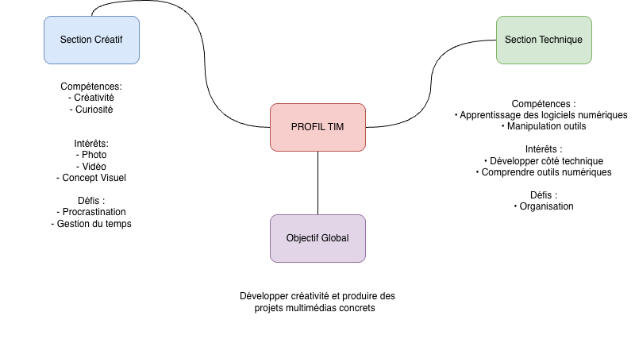

# Présentation Numérique – TIM  
**Auteur :** Alexander Rayner-Barcelli  
**Date :** 2025  

## Introduction  
Ce projet présente mon profil multimédia, mes forces, mes défis ainsi que mon parcours professionnel potentiel après la Technique d’Intégration Multimédia.  
Il inclut une **carte mentale**, un **diagramme de flux**, et des informations tirées de ma présentation PowerPoint.

---

## Carte Mentale  
### Section créative  
- **Compétences :** créativité, curiosité  
- **Intérêts :** photographie, vidéo, création de concepts visuels  
- **Défis :** procrastination, gestion du temps  

### Section technique  
- **Compétences :** apprentissage de logiciels, utilisation d’outils numériques, exploration informatique  
- **Interêts :** développer mon côté technique, comprendre les outils multimédia  
- **Défis :** organisation, constance  

---

## Diagramme de flux – Parcours TIM  
1. **Formation TIM**  
   - Cours en multimédia  
   - Bases techniques  

2. **Stages**  
   - Expérience professionnelle  
   - Développement de compétences appliquées  

3. **Projets personnels**  
   - Photo, vidéo  
   - Portfolio créatif  

4. **Choix de carrières possibles**  
   - **1. BAC en production cinématographique (Concordia)**  
   - **2. Développement Web** (création de pages web)  
   - Autres : photographie, vidéo, freelance multimédia  

---

## Moodboard, Carte mentale et Diagramme de flux  
*(À remplacer par tes liens ou images)*

- 
-  
- 

---

## Contenu résumé du PowerPoint  
- **Je suis une personne créative** avec un intérêt fort pour le multimédia.  
- **Motivation principale :** développer ma créativité et créer mes propres projets.  
- **Domaine préféré :** photographie et vidéo.  
- **Domaine moins préféré :** illustration.  
- **Carrières envisagées :** cinéma (BAC), développement web.  

---

## Conclusion  
Ce projet représente mon identité multimédia, mes ambitions et mon cheminement possible dans le domaine.
